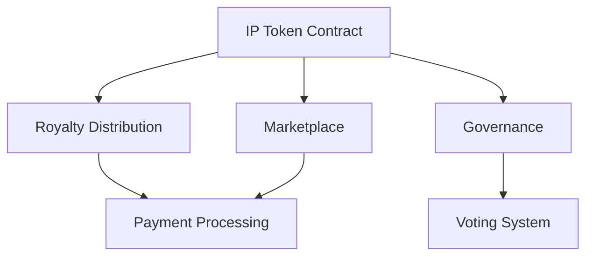

# IP Rights Management Smart Contract

A decentralized platform for tokenizing and managing intellectual property (IP) rights on the Stacks blockchain. This system enables creators to tokenize their IP assets, sell fractional ownership, and manage rights through automated smart contracts.

## Features

- **IP Token Management**
    - Mint NFTs representing IP rights
    - Transfer ownership
    - Track metadata and provenance

- **Royalty System**
    - Automated royalty distribution
    - Configurable royalty percentages
    - Real-time payment processing

- **Governance**
    - Proposal creation and voting
    - Democratic decision-making for IP usage
    - Time-locked voting periods

- **Marketplace**
    - List IP tokens for sale
    - Purchase with automatic royalty distribution
    - Active listing management

## Architecture



## Installation

1. Clone the repository:
```bash
git clone https://github.com/your-org/ip-rights-management.git
cd ip-rights-management
```

2. Install dependencies:
```bash
npm install
```

3. Setup Clarinet environment:
```bash
clarinet integrate
```

## Testing

Run the test suite:
```bash
npm test
```

Run with coverage:
```bash
npm run test:coverage
```

## Contract Deployment

1. Configure your network in `Clarinet.toml`

2. Deploy contracts:
```bash
clarinet deploy
```

## Usage Examples

### Minting an IP Token

```clarity
(contract-call? .ip-token mint 
    "https://example.com/ip/1" 
    "Patent XYZ" 
    "Revolutionary technology patent" 
    u10)
```

### Creating a Listing

```clarity
(contract-call? .ip-token create-listing u1 u1000)
```

### Voting on a Proposal

```clarity
(contract-call? .ip-token vote u1 true)
```

## Security Considerations

- Ownership validation on all transfers
- Royalty percentage limits
- Time-locked voting periods
- Access control for administrative functions

## Contributing

1. Fork the repository
2. Create your feature branch (`git checkout -b feature/amazing-feature`)
3. Commit your changes (`git commit -m 'Add amazing feature'`)
4. Push to the branch (`git push origin feature/amazing-feature`)
5. Open a Pull Request

## License

MIT License - see LICENSE.md for details

---

# Pull Request Details

## PR Title
Implement IP Rights Management Smart Contracts

## Description
This PR implements a comprehensive system for managing tokenized IP rights on the Stacks blockchain. The system enables creators to tokenize their intellectual property, manage ownership, distribute royalties, and govern usage rights through a decentralized platform.

### Key Changes
- Implemented IP token contract with NFT functionality
- Added royalty distribution system
- Created governance mechanism for IP usage decisions
- Implemented marketplace for token trading
- Added comprehensive test suite

### Technical Details
- Smart contracts written in Clarity
- Test suite using Vitest
- Integration with Stacks blockchain
- Automated royalty distribution

### Test Coverage
- Unit tests for all core functionality
- Integration tests for contract interactions
- Edge case handling
- Governance mechanism testing

## Checklist
- [x] Code follows style guidelines
- [x] Tests pass locally
- [x] Documentation updated
- [x] Security considerations addressed
- [x] Contract audit performed
- [x] Gas optimization implemented

## Testing Instructions
1. Clone the repository
2. Install dependencies: `npm install`
3. Run tests: `npm test`
4. Deploy locally: `clarinet deploy`

## Security Considerations
- Ownership validation
- Access control
- Time-locked voting
- Royalty limits

## Performance Impact
- Optimized storage usage
- Efficient royalty calculation
- Minimal gas consumption

## Related Issues
- #123 - IP Token Implementation
- #124 - Royalty Distribution System
- #125 - Governance Mechanism

## Screenshots/Videos
N/A - Smart contract implementation

## Additional Notes
This implementation focuses on security, efficiency, and usability. Future improvements could include:
- Enhanced metadata management
- Additional governance features
- Advanced royalty models
- Integration with external IP registries

